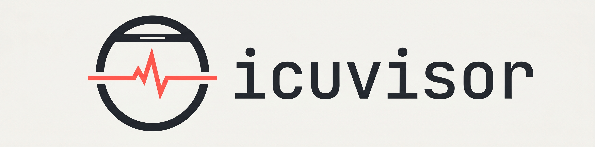

<p align="center">
  
</p>

[](https://pkg.go.dev/github.com/ricardocabral/icuvisor)
[](https://goreportcard.com/report/github.com/ricardocabral/icuvisor)
[](https://github.com/ricardocabral/icuvisor/actions/workflows/ci.yml)
[](https://github.com/ricardocabral/icuvisor/releases)
[](LICENSE)
[](go.mod)
<!-- [](https://codecov.io/gh/ricardocabral/icuvisor) -->
<!-- [](https://securityscorecards.dev/viewer/?uri=github.com/ricardocabral/icuvisor) -->
[](https://www.conventionalcommits.org)

> icuvisor is an open-source, locally installed [Model Context Protocol](https://modelcontextprotocol.io) server for [intervals.icu](https://intervals.icu), shipped as a single Go binary so athletes and coaches can talk to their training data from Claude, ChatGPT, Pi, Cursor, and other MCP-compatible clients. End-user docs live at <https://icuvisor.app>.

## For users

Install icuvisor, connect your AI assistant, and read the tool catalog at <https://icuvisor.app>.

## For developers

### Build from source

```bash
git clone https://github.com/ricardocabral/icuvisor.git
cd icuvisor
make build
./bin/icuvisor version
```

### Project layout

```
cmd/icuvisor/        Binary entrypoint
internal/app/        CLI dispatch, startup wiring, `setup` / `diagnostics` commands
internal/config/     Config load/validate/write, athlete-ID/timezone normalization, HTTP bind, dotenv, redaction
internal/credstore/  OS keychain wrapper (macOS Keychain, Windows Credential Manager, libsecret)
internal/intervals/  intervals.icu API client (Basic Auth, retries, structured errors)
internal/mcp/        MCP server + stdio/Streamable HTTP transports, schema, recovery
internal/tools/      Tool implementations (registered via `tools.Catalog()`)
internal/toolcatalog/ Catalog hashing and stale-catalog CI guard
internal/coach/      Coach-mode roster and per-athlete tool ACLs
internal/safety/     Delete-mode resolution and registration-time gating
internal/response/   Terse/full response shaping and `_meta` plumbing
internal/prompts/    Curated MCP prompt registry
internal/resources/  MCP Resources (workout syntax, event categories, schemas, athlete profile)
internal/workoutdoc/ WorkoutDoc Parse/Serialize for the upstream description DSL
docs/                PRD, roadmap, design notes
```

### Development

Requires Go 1.23+ and (optionally) [`golangci-lint`](https://golangci-lint.run) and [`goreleaser`](https://goreleaser.com).

```bash
make build       # build ./bin/icuvisor
make test        # unit tests
make test-race   # tests with the race detector
make lint        # golangci-lint
make snapshot    # local goreleaser snapshot
make docs-tools  # regenerate website tool catalog data
make help        # list all targets
```

See [CONTRIBUTING.md](CONTRIBUTING.md), [SECURITY.md](SECURITY.md), and the [PRD](docs/prd/PRD-icuvisor.md).

## License

[MIT](LICENSE).
